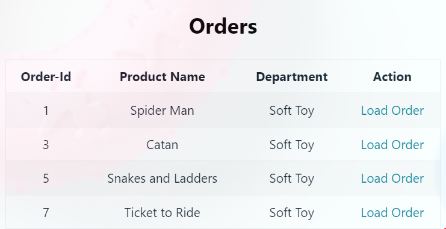
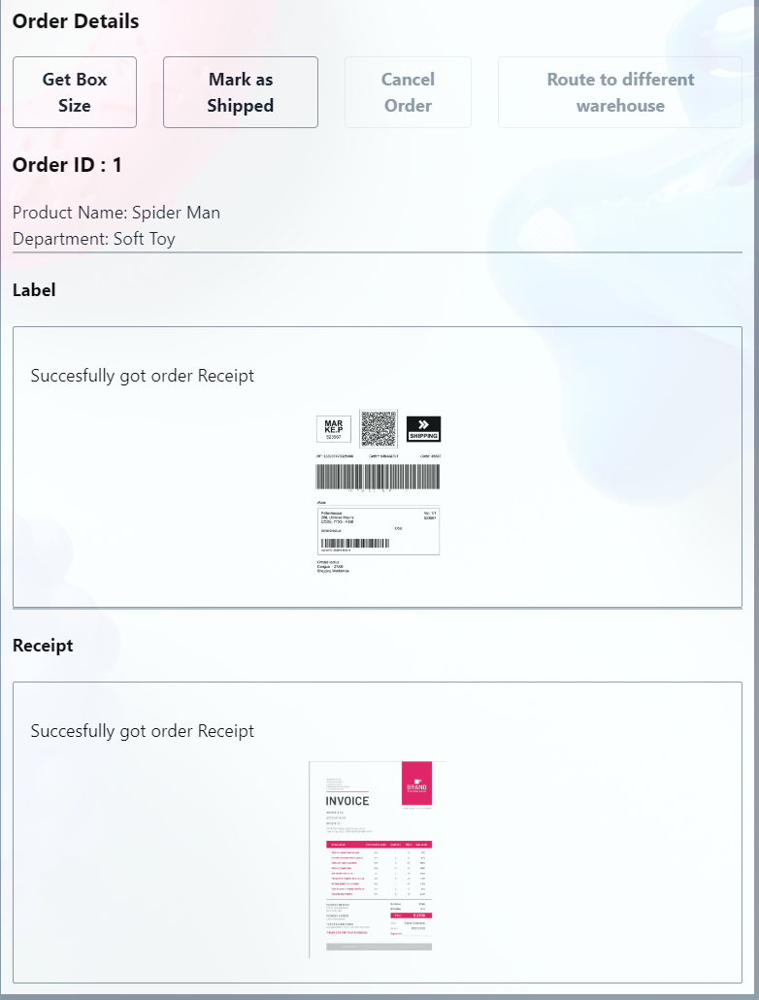
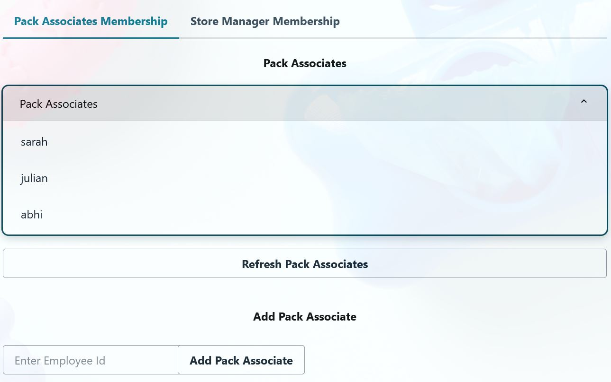
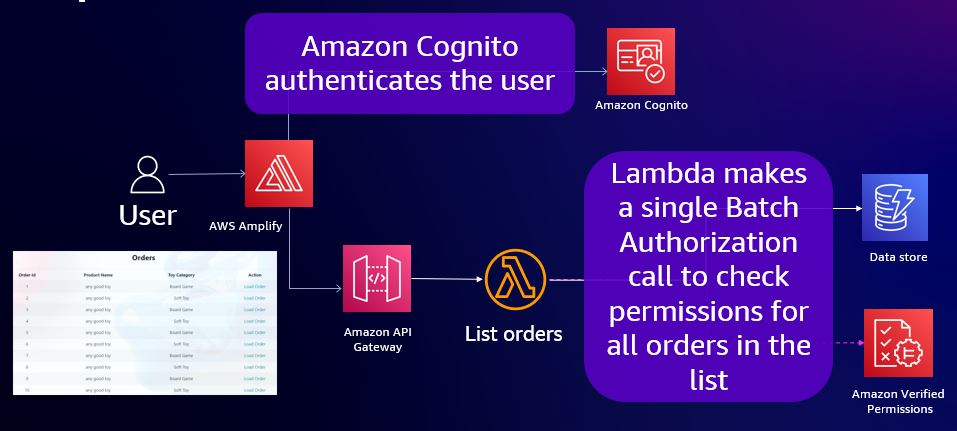
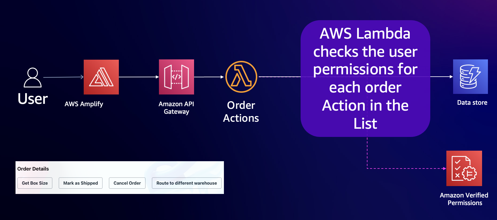
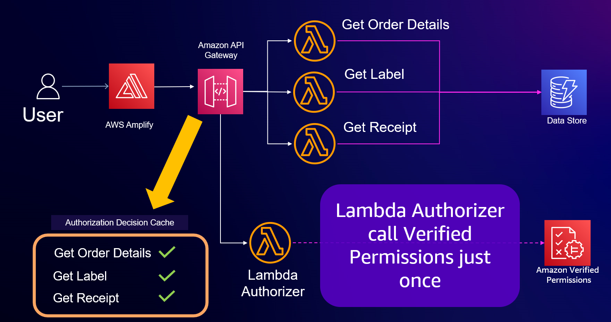

# AVP Toy Store Sample Application

## Introduction

This sample web application demonstrates authentication and policy-based authorization for different user types to an imaginary toy store. The toy store takes orders online and then send them to customers through multiple warehouses. This application is used by warehouses to help sending orders to customers.

The application uses Amazon Cognito for authentication and uses Amazon Verified Permissions for policy-based authorization. Additionally, the application uses API-Gateway as the front-door to the application, and Lambda to process requests.

**Note**: This package contains the backend resources of the application. Refer to avp-toy-store-sample-frontend for front end resources.

## Use Cases

The sample application is for managing fulfillment of orders in 4 toy stores. The application is based on 3 user personas

### Personas

1. **Admin**: The admin has complete access to all APIs and resources.

2. **Pack Associate**: A pack associate is responsible for processing orders. They are responsible for getting orders, putting them in boxes and attaching a shipping label.

3. **Store Manager**: A store manager is responsible for managing store associates and troubleshooting orders. 

### User Flows and Permissions

1. **Listing Orders**: Users can list orders. A user should only see the orders for which they have view permissions.
   1. **Pack Associates** can list all orders of their department
   2. **Store Manager** can list all orders of their store

Below diagram shows orders list for a pack associate 



2. **Order Actions**: Users can take some actions on an order. The application enables the buttons based on the user’s permissions.
   1. **Pack Associates** can get box size and mark an order as shipped
   2. **Store Manager** can take all the actions listed below.

Below diagram shows order actions for a pack associate


3. **Viewing an Order**: Users can view details of a specific order. When a user views an order, the applications loads the console details, label and receipt.



4. **Role Management**: Users can manage the roles of other users. They can view and add users to a role in the store.
   1. **Pack Associates** cannot view or add users to a role
   2. **Store Manager**  store managers can view and add users to a role for their store.



## High Level Design

### Policy Design

This section describes the Cedar [schema](https://www.cedarpolicy.com/en/tutorial/schema) and [policies](https://www.cedarpolicy.com/en/tutorial/policy-structure) used the application to implement the above use cases. You can learn more about [Cedar from its website](https://docs.cedarpolicy.com/terminology.html).

#### Schema

A schema is a declaration of the entity types supported by your application, and the actions your application may provide in authorization requests. The schema is used to define the principals, resources, and actions used by the application.

In case of this application, we define 3 entity types:

1. User
2. Store
3. Order

You can find the full schema [here](./authorization/schema)

#### Policies

With Cedar, permissions are expressed as sets of [policy statements](https://docs.cedarpolicy.com/terminology.html#policy). Each statement is a rule that permits or forbids a user (or principal) to act on a resource, given a defined context

In Cedar, you can create a policy in one of two ways:

- **Static policies**  – Standalone, complete policies that require no additional processing and are ready to be used in authorization decisions by Cedar.
- **Template-linked policies** – Policies created from a policy template. This policy type consists of a template that has placeholders for the principal, resource, or both. The template is completed by replacing the placeholders with specific values. This completed template results in a template-linked policy that can be evaluated at runtime like a static policy.

In this application, we implement access controls in the application, by deploying policies that grant access to different user personas. We implement access controls for admins using static policies and access controls for pack associates and store manager using template-linked policies. Remember, a policy store with no policies, always returns a deny decision.

**Note** that the principal of the policy is a specific user, which is specified in the policy using the format `cognito_user_pool_id|sub`. In all the examples, the user pool is *test_user_pool* and sub is *test sub*. In your application, you should set the principal based on the user being granted the role.

##### Admin Policy

Access controls for admins are implemented using static policies. The policy grants access to all resources and actions in the application to a specific user.  In our app, there is only 1 policy admin and admin permissions to the user are granted using the below policy.

```
permit(
  principal == avp::sample::toy::store::User::"test_user_pool|sub_admin_user",
  action,
  resource
) 
```

##### Pack Associate Policy

Access controls for pack associates are implemented using template-linked policies. A single policy template is created across all pack associates. The policy template  grants access to "Get Order" and has placeholders for user and resource.

```
permit (
    principal == ?principal, 
    action in [avp::sample::toy::store::Action::"GetOrder"],
    resource in ?resource
); 
```

A template-linked policy is createdg from the above policy template, when a pack associate is a toy store. Below is an example template-linked policy.

```
permit (
    principal == avp::sample::toy::store::User::"test_user_pool|sub_pack_associate_user",
    action in [avp::sample::toy::store::Action::"GetOrder"],
    resource in avp::sample::toy::store::Store::"toy store 1"
); 
```

The template linked policy grants a particular user access to GetOrder in a specific store.

##### Store Manager Policy

Access controls for store managers are implemented using template-linked policies. A single policy template is created for across store managers. The policy templates grants access to "Get Order" and "Add Pack Associates".

```
permit (
    principal == ?principal, 
    action in  [avp::sample::toy::store::Action::"AddPackAssociate", avp::sample::toy::store::Action::"GetOrder", avp::sample::toy::store::Action::"ListPackAssociates", avp::sample::toy::store::Action::"ListStoreManagers",avp::sample::toy::store::Action::"DeleteOrder"],
    resource in ?resource
); 
```

A template-linked policy is created from the above policy template, when a store manager is added to a toy store.

```
permit (
    principal == avp::sample::toy::store::User::"test_user_pool|sub_store_manager_user",
    action in [avp::sample::toy::store::Action::"GetOrder"],
    resource in avp::sample::toy::store::Store::"toy store 1"
); 
```

### Architectural Design

### Use-case - Listing Orders

**Architectural diagram**



1. The customer authenticates via Cognito and obtains an identity token
2. The customer uses Amplify to load the order page. The console calls the API ListOrders to load the order
3. The API is hosted in API-Gateway, and protected by a Lambda Authorizer.
4. The Lambda authorizer invokes Verified Permissions to authorize the request, after collecting entity information from an in-memory data store. The Lambda makes a single Batch Authorization request to  Verified Permissions to filter for only authorized resources.

**API**
- List Orders
  - **HTTP Path**: '/store/{store-id}/orders
  - **HTTP Method**: Get

### Use-case - Order Actions

**Architectural diagram**



1. The UI will send a request to execute Order Actions in order to display only authorized actions to the user
2. The Lambda will check against Verified Permissions for all actions applicable to the page by making a single batch authorization request.
3. The API returns the list of authorized actions for the user.

**API**
- List Order Actions
    - **HTTP Path**: /store/{store-id}/permissions
    - **HTTP Method**: Get

### Use-case: Viewing an Order

You can use batch authorization and decision caching to reduce latency. In the sample application, the cache is maintained by API-Gateway. The image below shows the reduction in console latency, by applying these techniques to the console application. The reduction in latency is primarily due to only calling the Lambda authorizer and Verified Permissions once for executing compound authorization with Verified Permissions.

**Architectural diagram**



1. The customer authenticates via Cognito and obtains an identity token
2. The customer uses Amplify to load the order page. The console calls 3 API (GetOrderDetails, GetLabel and GetReceipt) sequentially to load the order
3. All three APIs are hosted in API-Gateway, and protected by a Lambda Authorizer.
4. When the Lambda authorizer for the first API (GetOrderDetails) in invoked, it calls Batch Authorization to get authorization decisions for the requested action (GetOrderDetails) and related actions (GetLabel and GetReceipt). The Lambda authorizer returns the results of the authorization to API-Gateway as IAM policies as an IAM policy. Below is an example of the IAM policy returned by the authorizer Lambda.
5. API-Gateway caches the authorization decision based on the IAM policy.
6. If the request is allowed by the Lambda authorizer, API-Gateway calls Order Management Lambda, to process the request. This lambda represents the core service/lambda supporting the application and typically contains the core business logic of the application.
7. When subsequent API are called, the API-Gateway uses the cached authorization decisions and does not use the trigger the authorization lambda.

**API**
- Get Order Details
    - **HTTP Path**: '/store/{store-id}/order/{order-id}'
    - **HTTP Method**: Get
- Get Order Label
    - **HTTP Path**: '/store/{store-id}/order/{order-id}/label'
    - **HTTP Method**: Get
- Get Order Receipt
    - **HTTP Path**: '/store/{store-id}/order/{order-id}/receipt'
    - **HTTP Method**: Get

**Caching**

The application caches authorization results using API Gateway Lambda authorizer caching. You can learn more about API Gateway Lambda authorizer caching by referring to the *Caching authorizer responses* of the [API Gateway user guide](https://docs.aws.amazon.com/apigateway/latest/developerguide/http-api-lambda-authorizer.html).

This application enables caching based on IAM policy response. The cache key is a combination of the principal and [route](https://docs.aws.amazon.com/apigateway/latest/developerguide/http-api-develop-routes.html). The IAM policy that is returned is of the below format

```
{
  "principalId": "<sub>", // The sub from the identity token 
  "policyDocument": {
    "Version": "2012-10-17",
    "Statement": [
      {
        "Action": "execute-api:Invoke",
        "Effect": "<Authorization decision>",
        "Resource": [
                "arn:aws:execute-api:<aws-region>:<aws account>:<api-id>/<stage>/<http verb>/<http path-1>",
                "arn:aws:execute-api:<aws-region>:<aws account>:<api-id>/<stage>/<http verb>/<http path-2>",
                "arn:aws:execute-api:<aws-region>:<aws account>:<api-id>/<stage>/<http verb>/<http path-3>"
        ]               
      }
    ]
  }
}

```

Given below is a IAM policy returned by the authorizer when the authorizer allows the user with sub *test_sub* on the route *GET /store/store-1/order/order-1*. Additionally, the below IAM policy assumed that the API-Gateway is hosted in an AWS account with ID *123123123* in region *ap-southeast-2* and the API-ID is *abcdef123*. 

```
{
  "principalId": "test_sub", // The sub from the identity token 
  "policyDocument": {
    "Version": "2012-10-17",
    "Statement": [
      {
        "Action": "execute-api:Invoke",
        "Effect": "Allow",
        "Resource": [ 
             "arn:aws:execute-api:ap-southeast-2:123123123:abcdef123/prod/GET/store/store-1/order/order-1",
             "arn:aws:execute-api:ap-southeast-2:123123123:abcdef123/prod/GET/store/store-1/order/order-1/receipt",
             "arn:aws:execute-api:ap-southeast-2:123123123:abcdef123/prod/GET/store/store-1/order/order-1/label"
        ]
      }
    ]
  }
}
```

### Use-case: Role Management 

The sample application uses template linked policies to add/remove users for a role. Each role has a template which is created in the policy store using CFN. A total of 2 templates are created and the template-id for the created templates is set as an environment variable in Lambda. 
1. **Adding User**: Users are added to a role by creating a template linked policy. 
2. **Listing Users**: Users are listed by listing all template linked policies for a policy template, and extracting the principals from it. For example, the application lists Store Managers by list all policies with the store-manager policy template-id and then getting the principals from the policies  

**Architectural Flow**

**Adding Pack Associate**
1. The customer authenticates via Cognito and obtains an identity token
2. The customer uses Amplify to load the role management page for pack associates. The console calls an API to add a pack associate.
3. The API is hosted in API-Gateway, and protected by a Lambda Authorizer. The Lambda authorizer check whether the user has permission to `AddPackAssociate`. If the user is unauthorized, the API rejects the request.
4. The API-Gateway triggers the `RoleManagerGrantAccessLambda` lambda. 
5. The lambda calls Cognito to get the `sub` from the `user-id` for the pack associate.
6. The lambda call Verified Permissions to create a template linked policy with the principal as `userpool_id|sub` and resource as `store-id`  

**Listing Pack Associate**
1. The customer authenticates via Cognito and obtains an identity token
2. The customer uses Amplify to load the role management page for pack associates. The console calls an API to add a pack associate.
3. The API is hosted in API-Gateway, and protected by a Lambda Authorizer. The Lambda authorizer check whether the user has permission to `ListPackAssociates`. If the user is unauthorized, the API rejects the request.
4. The API-Gateway triggers the `RoleManagerListAccessLambda` lambda.
5. The lambda calls Verified Permissions to list policies with passing the filter of `pack associate template-id` and `store-id` 
6. The lambda extracts all the principals from the policy and gets a list of `sub` 
7. The lambda calls Cognito to get a list of `user-id` from the `sub`.

**API**
- List Pack Associates 
    - **HTTP Path**: '/store/{store-id}/pack_associate/{employee-id}'
    - **HTTP Method**: Get
- Add Pack Associate
    - **HTTP Path**: '/store/{store-id}/pack_associate/{employee-id}'
    - **HTTP Method**: Put
- List Pack Associates
    - **HTTP Path**: '/store/{store-id}/store_manager/{employee-id}'
    - **HTTP Method**: Get
- Add Pack Associate
    - **HTTP Path**: '/store/{store-id}/store_manager/{employee-id}'
    - **HTTP Method**: Put

## Deployment

1. Deploy the AVP-Toy-Store-sample-frontend first. Steps for the same are described here. Note the Cognito User pool id and Cognito User Pool ARN. You can find steps to these details here.  
2. Clone the AVP-Toy-Store-sample package.

```
git clone https://github.com/<git handle>/avp-toy-store-sample.git
```
3. Configure AWS credentials on the command line using [AWS Configure] (https://docs.aws.amazon.com/cli/latest/userguide/cli-chap-configure.html)

4. Run the below command to deploy the backend components using CloudFormation. The application name is of your choosing.

   - Windows

  ```
  mvn clean package aws:deployFileS3@file aws:deployS3@authorizationArtifacts aws:deployCf@cf aws:deployRestApi@api -Dmode=$MODE -Dapplication=<application name>-DCognitoUserPool=<Congito user pool id>  -Dregion=<region> -DCognitoUserPoolARN=<Congito user pool ARN
 ```
 
  - Linux and Mac

```
  ./deploy.sh
```

5. Update the Frontend code to use the newly created backend. 
   - Navigate to the [API-Gateway Console] (https://ap-south-1.console.aws.amazon.com/apigateway/main/apis) and select the API with name "avp-toy-store-sample" 
   - Note the "Invoke URL" of the stage "prod"
   - Navigate to the Amplify console, open the app deployed in Step-1.
   - Navigate to the Environment variables on the left, and update the variable as below

```
REACT_APP_BACKEND_ENDPOINT = <Invoke URL>
```

6. Re-Deploy the Amplify application 
   - Navigate to the Amplify application and select a hosting environment
   - Hit the "Redeploy this version" button.